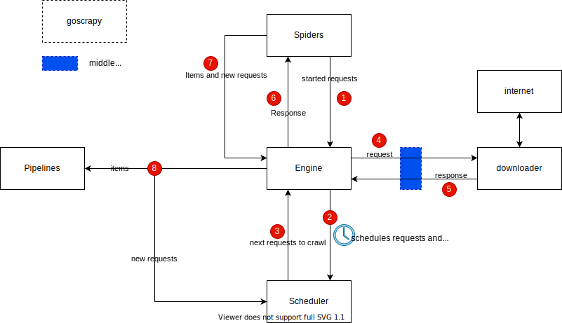

# goscrapy

goscrapy is a web crawling and web scraping framework written by golang. The architecture of goscrapy is similar to [python-scrpay](https://docs.scrapy.org/en/latest/topics/architecture.html), and described as following:

## Easy to use
An example usage is available at [here](example/).

goscrapy-cli is a command line tool which is helpful to auto-generate code template for you, see [goscrapy-cli](cmd/goscrapy-cli/README.md) for more details.
